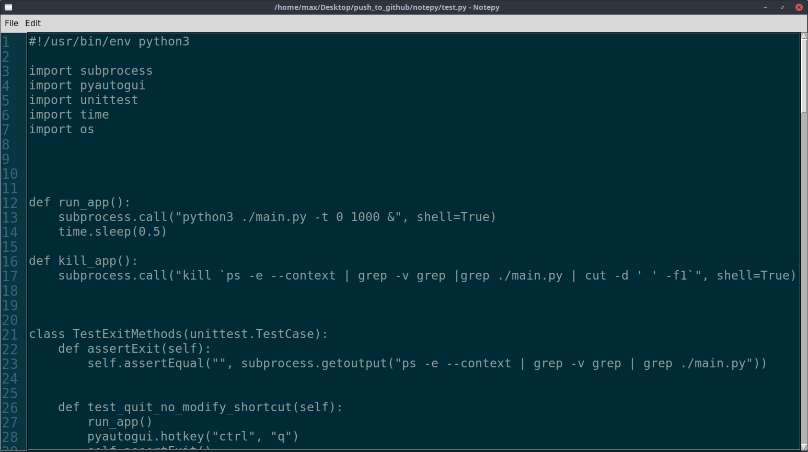

# notepy
A notebook created with python.

## Table of contents
* [General info](#general-info)
* [Technologies](#technologies)
* [Setup](#setup)
* [Test](#test)
* [Screenshots](#screenshots)

## General info
A side project focused on learning how to make GUI with python and playing with PyAutoGUI library.
Notepy consists in a simple notebook, it can be used to create new files, modify existing files, etc. The main feature of this notebook is that it is easily cutomizable adding plug-in.
	
## Technologies
Project is created with:
* python 3.6
* tkinter
* PyAutoGUI

see `requirements.txt` for a complete list of used libraries
	
## Setup
To run this project:

```
$ pip3 install -r requirements.txt
$ python3 main.py
```

If you want to add a plug-in, place the file in `plugin` folder, then add the import in `main.py` and modiy `start_app` function.

## Test
To run the test for the project:

```
$ pip3 install -r requirements.txt
$ python3 test.py
```

## Screenshots

